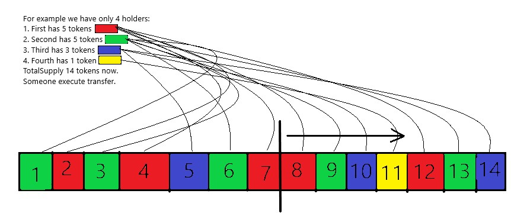

Technical Task:

Create an ERC-20 standard token named Test with the symbol TST. The maximum supply is 1,000,000, and it has 8 decimals. 
Upon deployment of the smart contract (SC), the creator is entitled to receive 5% of the maximum supply tokens. 
A timer is initialized at SC deployment for handling extra rewards. When the transfer or transferFrom functions are executed, 
extra rewards in tokens will be minted for the lottery winner. Extra rewards are calculated as 1 TST for 1 second since the previous transfer. 
For example, if an hour has passed between transfers, the winner must receive 3,600 TST tokens. After each transfer, the timer resets, 
and this process continues until the max supply of tokens is reached. In lotery can participate holders with more than 1 token balances.

The main task is to create the logic for choosing the winner with the following requirements:

    transfer or transferFrom functions must cost under 150,000 gas.
    The process must be transparent. Ideally, the SC alone should execute all functions related to choosing the winner.

Logic for choosing the winner:
From the SC information, we have a list of all token holders and their balances. A script for the token should be written to handle 2000 or more 
holders without implementing burn logic. All holders are placed in a lottery list starting from the center and moving to the right. 
Ceneter of this list is equal to totalSupply/2. If totalSupply/2 even then we start fill from totalSupply/2+1, if not - we cut fractional part of result 
and still do+1. For example if totalSupply 15 - we start fill list from 8, if totalSupply 16 - we start fill list from 9.
The list is filled, and the remaining balance for each holder is calculated. Every fill of the lottery list for a particular holder "costs" 
them 1 token from their balance. This deduction is not subtracted directly from the balance. For example, a holder with 10 tokens can receive 
only 10 "lottery tickets" and can include in the lottery list only 10 times. If the balance of a particular holder falls below 1 token after 
filling the lottery list, that holder does not participate in further "lottery tickets" allocation. The process repeats for the remaining holders, 
moving to the left, and checks their balances. The process moves to the right again and repeats until all holders have their "virtual balances" 
(). A random number is then generated within the total number of lottery tickets, and the holder of the token from the 
lottery list with an index equal to that random number becomes the winner. The mint function is executed to reward the winner, 
including extra rewards based on the timer. 
